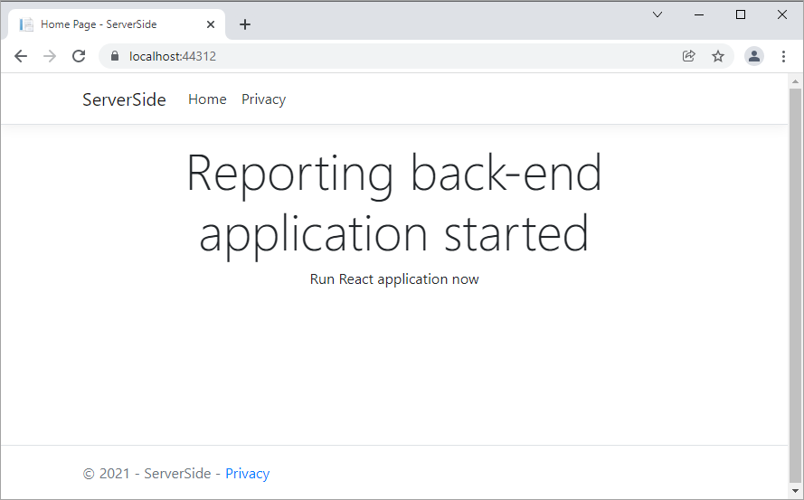
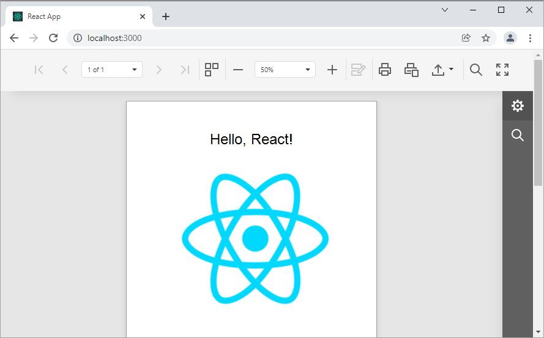
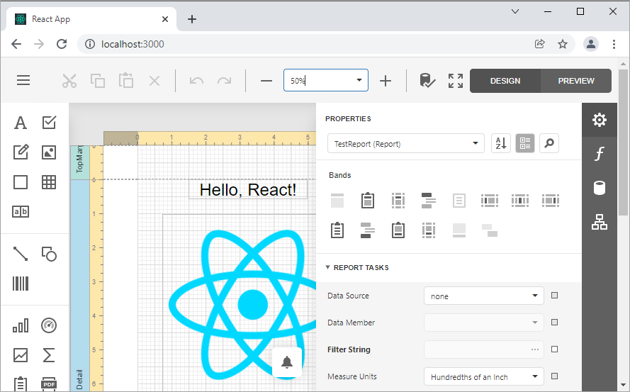

<!-- default badges list -->

[](https://supportcenter.devexpress.com/ticket/details/T848273)
[](https://docs.devexpress.com/GeneralInformation/403183)
<!-- default badges end -->
# How to Use the ASP.NET Core Back-End to Integrate the Document Viewer and Report Designer in JavaScript with React Library

This example consists of two parts: 

- A server (back-end) ASP.NET Core project that enables [cross-domain requests (CORS)](https://developer.mozilla.org/en-US/docs/Web/HTTP/CORS) (Access-Control-Allow-Origin) and implements a custom web report storage.

- Document Viewer and Report Designer front-end client applications created with the [React JavaScript Library](https://reactjs.org/).

## How to Run the Example

Perform the following steps to run this example:

1. Open the back-end project solution (**CS\ServerSide.sln**) in Visual Studio and run the project. 

    

2. Navigate to the **JS\react-document-viewer** folder that is the client part's root folder. Open the src\App.js file and change the port number in the **host** setting to the back-end application's port.
3. Open the console and run the following command:

    ```npm install```

4. Run the command to compile and start the client part:

    ```npm start```

5. The client application opens the browser at http://localhost:3000/. It displays the **Document Viewer** with the **Products** report.

    

6. Navigate to the **JS\react-report-designer** folder that is the client part's root folder. Open the src\App.js file and change the port number in the **host** setting to the back-end application's port.

7. Open the console and run the following command:

    ```npm install```

8. Run the command to compile and start the client part:

    ```npm start```

9. The client application opens the browser at http://localhost:3000/. It displays the **Report Designer** with the **Products** report.

    


## Files to Look At


- [Startup.cs](./ServerSide/ServerSide/Startup.cs)
- [ReportDesignerController.cs](./ServerSide/ServerSide/Controllers/ReportDesignerController.cs)
- [react-document-viewer/src/App.js](./react-document-viewer/src/App.js)
- [react-report-designer/src/App.js](./react-report-designer/src/App.js)


## Documentation

- [Report Designer's Server-Side Configuration (ASP.NET Core)](https://docs.devexpress.com/XtraReports/400196)
- [Document Viewer Integration in React](https://docs.devexpress.com/XtraReports/119338)
- [Report Designer Integration in React](https://docs.devexpress.com/XtraReports/119339)

## More Examples

- [How to Use the Document Viewer in JavaScript with React Library and Npm Package Manager](https://github.com/DevExpress-Examples/reporting-document-viewer-in-javascript-with-react)
- [How to Use the Report Designer in JavaScript with React Library and Npm Package Manager](https://github.com/DevExpress-Examples/reporting-eud-designer-in-javascript-with-react)
- [How to Print and Export a Report in a React Application without Displaying the Report](https://github.com/DevExpress-Examples/Reporting-React-Print-Without-Preview)
